<!-- Converted from HPL Algorithm / HPL 算法 -->

<H2>HPL Algorithm / HPL 算法</H2>

<STRONG>
This  page provides  a high-level description of the algorithm used in
this package. As indicated below,  HPL  contains in fact many possible
variants for various operations.  Defaults could have been chosen,  or
even  variants  could  be selected  during  the execution.  Due to the
performance requirements,  it was  decided  to leave the user with the
opportunity of choosing,  so that an "optimal" set of parameters could
easily be experimentally determined for a given machine configuration.
From a numerical accuracy point of view, <STRONG>all</STRONG> possible
combinations are rigorously equivalent  to each other  even though the
result may slightly differ (bit-wise).
</STRONG>  
<strong>
本页面提供了此软件包所用算法的高层描述。如下所述，HPL 实际上包含了多种操作的可能变体。本可以选择默认值，甚至在执行期间选择变体。由于性能要求，决定让用户有机会进行选择，以便可以轻松地通过实验确定给定机器配置的"最优"参数集。从数值精度的角度来看，<strong>所有</strong>可能的组合在数学上是严格等价的，尽管结果可能略有不同（按位级别）。
</strong>  

<UL>
<LI><A HREF="algorithm.md#main">Main Algorithm / 主算法</A>
<LI><A HREF="algorithm.md#pfact">Panel Factorization / 面板分解</A>
<LI><A HREF="algorithm.md#bcast">Panel Broadcast / 面板广播</A>
<LI><A HREF="algorithm.md#look_ahead">Look-ahead / 前瞻</A>
<LI><A HREF="algorithm.md#update">Update / 更新</A>
<LI><A HREF="algorithm.md#trsv">Backward Substitution / 回代</A>
<LI><A HREF="algorithm.md#check">Checking the Solution / 验证解</A>
</UL>

<H3><A NAME="main">Main Algorithm / 主算法</A></H3>

This  software  package  solves  a linear system  of order n:  A x = b by
first  computing  the  LU  factorization with row partial pivoting of the
n-by-n+1 coefficient matrix [A b] = [[L,U] y]. Since the lower triangular
factor L is applied to b as the factorization progresses, the solution  x
is obtained  by  solving  the upper triangular system U x = y.  The lower
triangular  matrix  L  is left unpivoted  and  the array of pivots is not
returned.  
本软件包求解 n 阶线性方程组：A x = b，首先对 n×(n+1) 系数矩阵 [A b] = [[L,U] y] 进行带行部分主元的 LU 分解。由于下三角因子 L 在分解过程中被应用于 b，因此解 x 通过求解上三角方程组 U x = y 获得。下三角矩阵 L 保持未主元化状态，且不返回主元数组。  

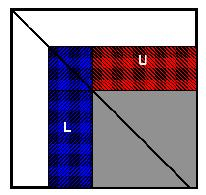

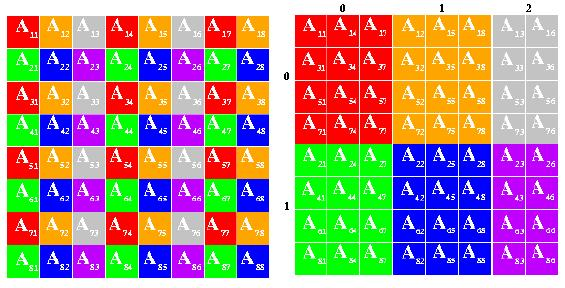

<TABLE HSPACE=0 VSPACE=0 WIDTH=100% BORDER=0 CELLSPACING=1 CELLPADDING=0>
<TR>
<TD ALIGN=LEFT>
The  data  is distributed onto a two-dimensional P-by-Q grid of processes
according  to  the  block-cyclic  scheme  to ensure  "good"  load balance
as well as  the scalability  of the algorithm.  The  n-by-n+1 coefficient
matrix is  first  logically partitioned into  nb-by-nb  blocks,  that are
cyclically "dealt" onto the  P-by-Q  process grid.  This is done  in both
dimensions of the matrix.</TD>
<TD ALIGN=CENTER></TD>
</TR>
</TABLE>
<TABLE HSPACE=0 VSPACE=0 WIDTH=100% BORDER=0 CELLSPACING=1 CELLPADDING=0>
<TR>
<TD ALIGN=CENTER></TD>
<TD ALIGN=LEFT>
The  right-looking  variant  has been chosen for the main loop of the  LU
factorization.  This  means that at each iteration of the loop a panel of
nb columns is factorized,  and  the  trailing submatrix is updated.  Note
that this computation is  thus  logically partitioned with the same block
size nb that was used for the data distribution.</TD>
</TR>
</TABLE>

数据按照块循环方案分布到 P×Q 的二维进程网格上，以确保"良好"的负载平衡以及算法的可扩展性。n×(n+1) 系数矩阵首先被逻辑划分为 nb×nb 个块，这些块循环地"分配"到 P×Q 进程网格上。这种划分在矩阵的两个维度上同时进行。

LU 分解的主循环选择了右视变体。这意味着在循环的每次迭代中，一个包含 nb 列的面板被分解，然后更新尾部子矩阵。注意，此计算因此使用与数据分布相同的块大小 nb 进行逻辑划分。

<H3><A NAME="pfact">Panel Factorization / 面板分解</A></H3>

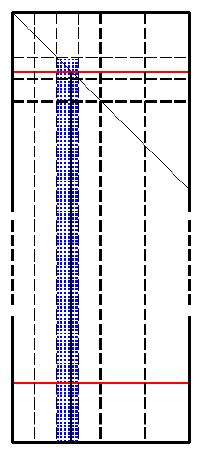

<TABLE HSPACE=0 VSPACE=0 WIDTH=100% BORDER=0 CELLSPACING=1 CELLPADDING=10>
<TR>
<TD ALIGN=LEFT>
At  a given iteration  of the main loop,  and  because of  the  cartesian 
property of the distribution scheme,  each panel factorization  occurs in
one column of processes.   This  particular part of the computation  lies
on the critical path of  the overall algorithm.  The user is  offered the
choice of three  (Crout, left- and right-looking)  matrix-multiply  based 
recursive variants. The software also allows the user  to choose  in  how
many  sub-panels  the current panel  should be divided  into  during  the
recursion.  Furthermore,  one  can also  select at run-time the recursion
stopping criterium in terms of the number  of  columns left to factorize.
When this  threshold is reached,  the sub-panel will  then be  factorized
using one of the three Crout, left- or right-looking matrix-vector  based 
variant.  Finally, for each panel column the pivot search, the associated
swap  and broadcast  operation  of  the pivot row  are combined  into one 
single communication step.  A   binary-exchange  (leave-on-all) reduction
performs these three operations at once.</TD>
<TD ALIGN=CENTER></TD>
</TR>
</TABLE>

在主循环的给定迭代中，由于分布方案的笛卡尔性质，每个面板分解发生在一个进程列中。这部分计算位于整个算法的关键路径上。用户可以选择三种（Crout、左视和右视）基于矩阵乘法的递归变体。软件还允许用户选择当前面板在递归过程中应被划分为多少个子面板。此外，用户还可以在运行时选择递归停止准则，以剩余待分解的列数表示。当达到此阈值时，子面板将使用三种 Crout、左视或右视基于矩阵-向量的变体之一进行分解。最后，对于每个面板列，主元搜索、相关的交换和主元行的广播操作被合并为一个通信步骤。二进制交换（全保留）归约同时执行这三个操作。

<H3><A NAME="bcast">Panel Broadcast / 面板广播</A></H3>

Once  the panel factorization has been computed,  this  panel  of columns
is  broadcast  to the other process columns.   There  are  many  possible 
broadcast  algorithms  and  the  software currently offers  6 variants to 
choose from.  These variants are described below assuming  that process 0
is the source of the broadcast for convenience. "->" means "sends to".
  
一旦面板分解计算完成，此列面板将被广播到其他进程列。有多种可能的广播算法，软件目前提供 6 种变体供选择。为方便起见，以下描述假设进程 0 是广播的源。"->" 表示"发送给"。
<UL>
<LI><STRONG>Increasing-ring / 递增环</STRONG>:  0 -> 1;  1 -> 2; 2 -> 3 and so on.
This algorithm is the classic one;  it has  the caveat that process 1 has
to send a message.
此算法是经典的广播算法；其缺点是进程 1 必须发送一条消息。

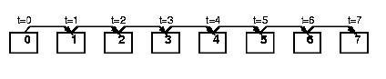

<LI><STRONG>Increasing-ring (modified) / 递增环（修改版）</STRONG>:  0 -> 1;  0 -> 2; 2 -> 3
and so on. Process 0 sends two messages and process 1  only  receives one
message. This algorithm is almost always better, if not the best.
进程 0 发送两条消息，进程 1 只接收一条消息。此算法几乎总是更好的选择，如果不是最佳的话。

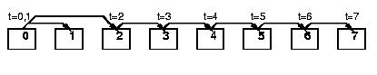

<LI><STRONG>Increasing-2-ring / 递增双环</STRONG>:  The Q processes are divided into
two parts: 0 -> 1 and 0 -> Q/2;  Then processes 1  and Q/2 act as sources
of two rings: 1 -> 2, Q/2 -> Q/2+1;  2 -> 3, Q/2+1 -> to Q/2+2 and so on.
This  algorithm has the advantage  of reducing the time by which the last
process  will  receive  the  panel  at  the cost of process 0 sending 2
messages.
Q 个进程被分为两部分：0 -> 1 和 0 -> Q/2；然后进程 1 和 Q/2 作为两个环的源：1 -> 2, Q/2 -> Q/2+1；2 -> 3, Q/2+1 -> Q/2+2，以此类推。此算法的优点是减少了最后一个进程接收面板的时间，代价是进程 0 需要发送 2 条消息。

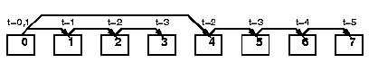

<LI><STRONG>Increasing-2-ring (modified) / 递增双环（修改版）</STRONG>:  As  one  may  expect,
first 0 -> 1,  then  the  Q-1  processes  left are divided into two equal
parts: 0 -> 2 and 0 -> Q/2;  Processes  2 and Q/2  act then as sources of
two rings:  2 -> 3,  Q/2 -> Q/2+1; 3 -> 4,  Q/2+1 -> to Q/2+2  and so on.
This algorithm is probably  the most serious competitor to the increasing
ring modified variant.
正如预期的那样，首先 0 -> 1，然后剩余的 Q-1 个进程被分为两个相等的部分：0 -> 2 和 0 -> Q/2；进程 2 和 Q/2 然后作为两个环的源：2 -> 3, Q/2 -> Q/2+1；3 -> 4, Q/2+1 -> Q/2+2，以此类推。此算法可能是递增环修改版变体最有力的竞争者。

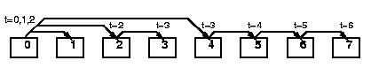

<LI><STRONG>Long  (bandwidth  reducing) / 长条（带宽减少）</STRONG>:  as   opposed   to  the
previous  variants,  this  algorithm  and  its follower  synchronize  all 
processes involved in the operation. The message is chopped into  Q equal
pieces that are scattered  across the Q processes. 
与前面的变体不同，此算法及其后续算法同步所有参与操作的进程。消息被切分为 Q 个相等的片段，分散到 Q 个进程中。

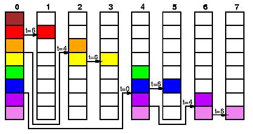

The pieces are then rolled in Q-1 steps.  The scatter phase uses a binary
tree and the rolling phase exclusively uses mutual message exchanges.  In
odd steps 0 <-> 1,  2 <-> 3, 4 <-> 5 and so on;  in even steps Q-1 <-> 0,
1 <-> 2, 3 <-> 4, 5 <-> 6 and so on.
然后这些片段在 Q-1 步中滚动。散射阶段使用二叉树，滚动阶段仅使用互惠消息交换。在奇数步中 0 <-> 1, 2 <-> 3, 4 <-> 5，以此类推；在偶数步中 Q-1 <-> 0, 1 <-> 2, 3 <-> 4, 5 <-> 6，以此类推。

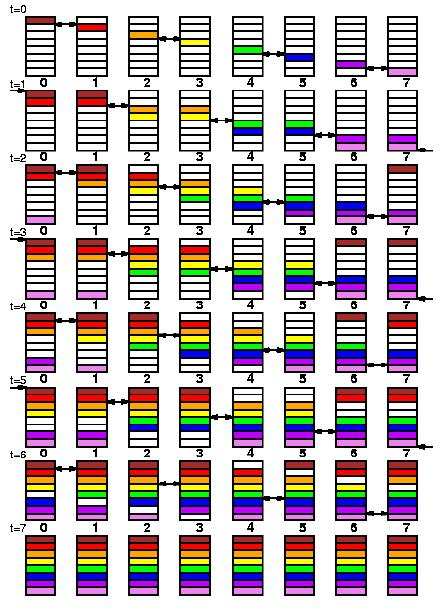

More messages are exchanged, however the total volume of communication is
independent of Q, making this algorithm  particularly suitable for  large
messages.  This algorithm  becomes  competitive  when the nodes are "very 
fast" and the network (comparatively) "very slow".  
交换的消息更多，但总通信量与 Q 无关，使得此算法特别适合大消息。当节点"非常快"而网络（相对）"非常慢"时，此算法变得有竞争力。  

<LI><STRONG>Long (bandwidth reducing modified) / 长条（带宽减少修改版）</STRONG>:  same  as above,
except that 0 -> 1 first,  and then the Long variant is used on processes
0,2,3,4 .. Q-1.  
与上述相同，只是首先 0 -> 1，然后在进程 0,2,3,4 .. Q-1 上使用长条变体。  

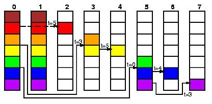
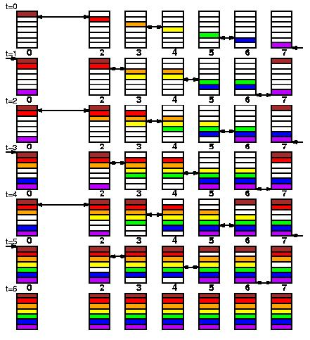

</UL>

The rings variants are distinguished by a probe mechanism  that activates
them.  In other words,  a process involved in the broadcast and different
from  the source asynchronously  probes for the message to receive.  When
the  message  is  available  the broadcast proceeds,  and  otherwise  the
function returns.  This allows to interleave the broadcast operation with
the update phase. This contributes to reduce the idle time spent by those
processes waiting for the factorized panel.  This  mechanism is necessary
to accomodate for various computation/communication performance ratio.  
环形变体通过激活它们的探测机制来区分。换句话说，参与广播且不同于源的进程异步探测要接收的消息。当消息可用时，广播继续进行，否则函数返回。这允许将广播操作与更新阶段交错进行。这有助于减少那些等待已分解面板的进程所花费的空闲时间。这种机制是必要的，以适应各种计算/通信性能比。  

<H3><A NAME="look_ahead">Look-ahead / 前瞻</A></H3>

Once the panel has been broadcast or say during this broadcast operation,
the trailing submatrix is updated  using the last panel in the look-ahead
pipe: as mentioned before,  the panel factorization  lies on the critical
path,  which  means  that when the kth panel has been factorized and then 
broadcast, the next most urgent task to complete is the factorization and
broadcast of the k+1 th panel.  This technique  is  often  refered  to as
"look-ahead" or "send-ahead" in the literature.  This  package  allows to
select various "depth" of look-ahead.  By  convention,  a  depth  of zero
corresponds to no lookahead,  in which case  the  trailing  submatrix  is
updated by the panel currently broadcast.  Look-ahead consumes some extra
memory  to  essentially  keep  all the panels of columns currently in the
look-ahead pipe.  A look-ahead  of depth 1 (maybe 2) is likely to achieve
the best performance gain.   
一旦面板被广播，或者说在此广播操作期间，尾部子矩阵使用前瞻管道中的最后一个面板进行更新：如前所述，面板分解位于关键路径上，这意味着当第 k 个面板被分解并广播后，下一个最紧急的任务是完成第 k+1 个面板的分解和广播。这种技术在文献中通常被称为"前瞻"或"预发送"。此软件包允许选择不同"深度"的前瞻。按照约定，深度为零表示没有前瞻，在这种情况下，尾部子矩阵由当前广播的面板更新。前瞻消耗一些额外的内存，主要用于保留当前在前瞻管道中的所有列面板。深度为 1（可能为 2）的前瞻可能实现最佳的性能提升。  

<H3><A NAME="update">Update / 更新</A></H3>

The update of the trailing submatrix by the last panel in the  look-ahead
pipe is made of two phases. First, the pivots must be applied to form the
current <mark>row panel U</mark>. U should then be solved by the upper triangle of the
column panel. U finally needs to be broadcast to each process row so that
the  local  rank-nb  update  can take place.  We choose  to  combine  the
swapping and broadcast of  U  at the cost of  replicating the solve.  Two
algorithms are available for this communication operation.
  
使用前瞻管道中的最后一个面板更新尾部子矩阵由两个阶段组成。首先，必须应用主元以形成当前行面板 U。然后 U 应由列面板的上三角求解。最后 U 需要被广播到每个进程行，以便可以进行局部的秩-nb 更新。我们选择以复制求解为代价来组合 U 的交换和广播。此通信操作有两种算法可用。

<UL>
<LI><STRONG>Binary-exchange / 二进制交换</STRONG>:  this is a modified variant  of the
binary-exchange (leave on all) reduction operation.  Every process column
performs the same operation.  The algorithm essentially works as follows.
It pretends reducing the row panel U, but at the beginning the only valid
copy is owned by the current process row.  The  other process  rows  will
contribute rows of A they own that should be copied in U and replace them
with rows that were originally in the current process row.  The  complete
operation is performed in  log(P) steps.  For the sake of simplicity, let
assume that  P  is a power of two.  At step k,  process row p exchanges a 
message with process row p+2^k.  There are  essentially two cases. First,
one of those two process rows  has received  U  in  a previous step.  The
exchange occurs.  One process  swaps  its  local rows of  A into U.  Both
processes copy in  U remote rows of A. Second, none of those process rows
has received U,  the exchange occurs, and both processes simply add those
remote rows  to  the list  they have accumulated so far.  At each step, a 
message  of  the size of  U  is exchanged by at least one pair of process
rows.  
这是二进制交换（全保留）归约操作的修改变体。每个进程列执行相同的操作。该算法基本上如下工作。它假装归约行面板 U，但一开始唯一有效的副本由当前进程行拥有。其他进程行将贡献它们拥有的 A 的行，这些行应该被复制到 U 中，并用原来在当前进程行中的行替换它们。完整的操作在 log(P) 步中完成。为简单起见，假设 P 是 2 的幂。在第 k 步，进程行 p 与进程行 p+2^k 交换消息。基本上有两种情况。首先，这两个进程行中的一个在前面的步骤中已经收到了 U。交换发生。一个进程将其 A 的本地行交换到 U 中。两个进程都复制 A 的远程行到 U 中。其次，这两个进程行都没有收到 U，交换发生，两个进程只是将这些远程行添加到它们到目前为止累积的列表中。在每一步中，至少有一对进程行交换大小为 U 的消息。  

- 没懂啥是复制到U里

- <LI><STRONG>Long / 长条</STRONG>:   this  is   a   bandwidth   reducing  variant
  accomplishing the same task. The row panel is first spread (using a tree)
  among the process rows with respect to the pivot array. This is a scatter
  (V variant for MPI users).  Locally,  every process row  then swaps these
  rows with the the rows of A it owns and that belong to U.  These  buffers
  are then rolled  (P-1 steps) to finish the broadcast of U.  Every process
  row permutes U and proceed  with the computational part of the update.  A
  couple  of  notes:   process  rows  are  logarithmically   sorted  before
  spreading,  so  that  processes  receiving the largest number of rows are
  first in the tree.  This makes  the communication volume optimal for this
  phase. Finally, before rolling and after the local swap, an equilibration
  phase occurs during  which the local pieces of  U  are  uniformly  spread
  across  the process rows.  A tree-based algorithm is used. This operation
  is necessary to keep the rolling phase optimal  even  when the pivot rows
  are  not  equally distributed  in process rows.  This  algorithm  has  a 
  complexity  in  terms  of communication volume that solely depends on the 
  size of U.  In particular,  the number of process rows  only  impacts the
  number of messages exchanged.  It  will  thus  outperforms  the  previous
  variant for large problems on large machine configurations.  
  这是一种带宽减少的变体，完成相同的任务。行面板首先根据主元数组（使用树）在进程行之间分散。这是一种散射（MPI 用户的 V 变体）。在本地，每个进程行然后将这些行与其拥有的且属于 U 的 A 的行进行交换。然后这些缓冲区被滚动（P-1 步）以完成 U 的广播。每个进程行置换 U 并继续更新的计算部分。几点说明：进程行在分散之前按对数排序，以便接收最多行数的进程在树中最先。这使得此阶段的通信量最优。最后，在滚动之前和本地交换之后，发生一个均衡阶段，在此阶段 U 的本地片段均匀分布在进程行之间。使用基于树的算法。此操作是必要的，以保持滚动阶段即使在主元行在进程行中不均匀分布时也是最优的。此算法在通信量方面的复杂度仅取决于 U 的大小。特别是，进程行的数量仅影响交换的消息数量。因此，对于大型机器配置上的大型问题，它将优于前一种变体。  

</UL>

The user can select any of the two variants above.  In addition, a mix is
possible as well.  The  "binary-exchange"  algorithm will be used when  U
contains at most a certain number of columns. Choosing at least the block
size  nb as the threshold value is clearly recommended when look-ahead is
on.  
用户可以选择上述两种变体中的任何一种。此外，也可以混合使用。当 U 包含最多一定数量的列时，将使用"二进制交换"算法。当开启前瞻时，明确建议选择至少块大小 nb 作为阈值。  

<H3><A NAME="trsv">Backward Substitution / 回代</A></H3>

The factorization has just now ended, the back-substitution remains to be
done.  For this,  we  choose  a look-ahead  of  depth  one  variant.  The
right-hand-side  is  forwarded  in  process  rows  in  a decreasing-ring 
fashion,  so that  we solve Q * nb entries at a time.  At each step, this
shrinking piece of the right-hand-side is updated. The process just above
the one owning the current diagonal block of the matrix  A  updates first 
its last nb piece of x,  forwards it to the previous process column, then
broadcast  it in the process column in a decreasing-ring fashion as well.
The solution is then updated and sent to the previous process column. The
solution of the linear system is left replicated in every process row.  
分解刚刚结束，还需要进行回代。为此，我们选择深度为 1 的前瞻变体。右端项以递减环的方式在进程行中转发，因此我们每次求解 Q * nb 个条目。在每一步中，右端项的这个缩小部分被更新。拥有矩阵 A 的当前对角块的进程上方的进程首先更新其最后 nb 片段的 x，将其转发到前一个进程列，然后也以递减环的方式在进程列中广播它。然后解被更新并发送到前一个进程列。线性方程组的解在每个进程行中保留副本。  

<H3><A NAME="check">Checking the Solution / 验证解</A></H3>

To verify the result obtained,  the input matrix  and right-hand side are
regenerated.  The  normwise  backward  error  (see formula below) is then
computed.  A solution  is  considered  as "numerically correct" when this
quantity  is  less  than  a threshold value of the order of 1.0. In the
expression   below,  eps  is  the  relative  (distributed-memory) machine
precision.
  
为了验证获得的结果，重新生成输入矩阵和右端项。然后计算范数向后误差（见下面的公式）。当此量小于约 1.0 阶的阈值时，解被认为是"数值正确的"。在下面的表达式中，eps 是相对（分布式内存）机器精度。

<UL>
<LI>|| Ax - b ||_oo / ( eps * ( || A ||_oo * || x ||_oo + || b ||_oo ) * n )
</UL>

<A HREF = "index.md">            [Home / 首页]</A>
<A HREF = "copyright.md">        [Copyright and Licensing Terms / 版权和许可条款]</A>
<A HREF = "algorithm.md">        [Algorithm / 算法]</A>
<A HREF = "scalability.md">      [Scalability / 可扩展性]</A>
<A HREF = "results.md">          [Performance Results / 性能结果]</A>
<A HREF = "documentation.md">    [Documentation / 文档]</A>
<A HREF = "software.md">         [Software / 软件]</A>
<A HREF = "faqs.md">             [FAQs / 常见问题]</A>
<A HREF = "tuning.md">           [Tuning / 调优]</A>
<A HREF = "errata.md">           [Errata-Bugs / 勘误-错误]</A>
<A HREF = "references.md">       [References / 参考文献]</A>
<A HREF = "links.md">            [Related Links / 相关链接]</A> 

